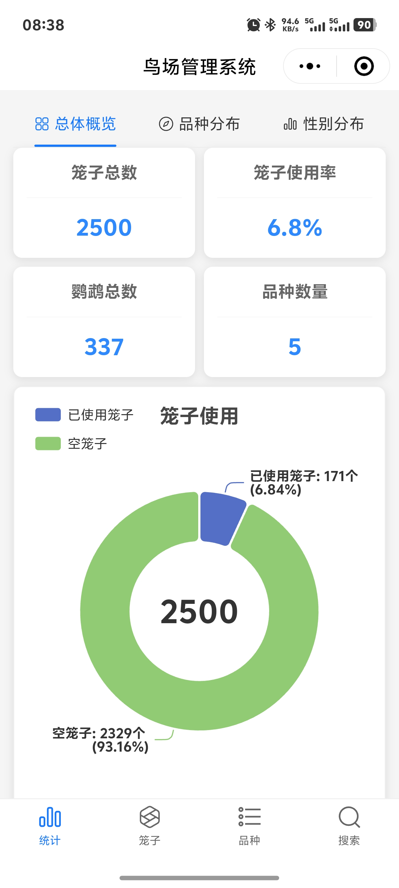
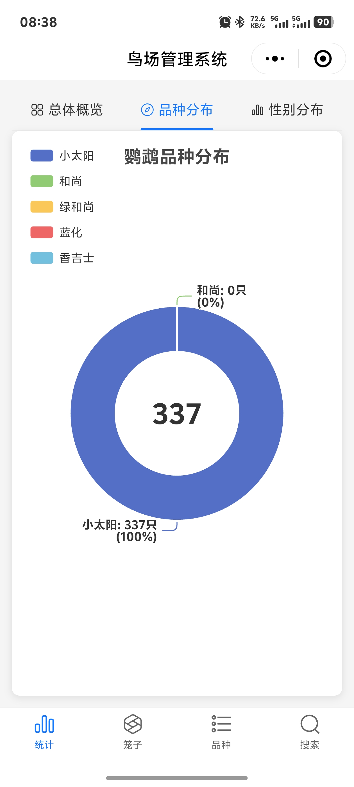
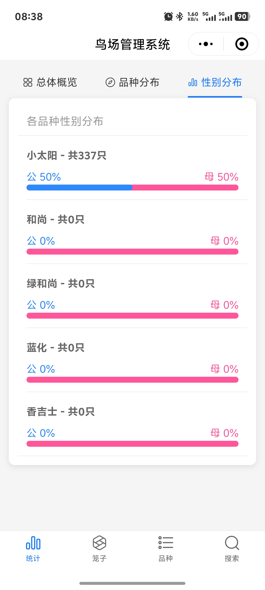
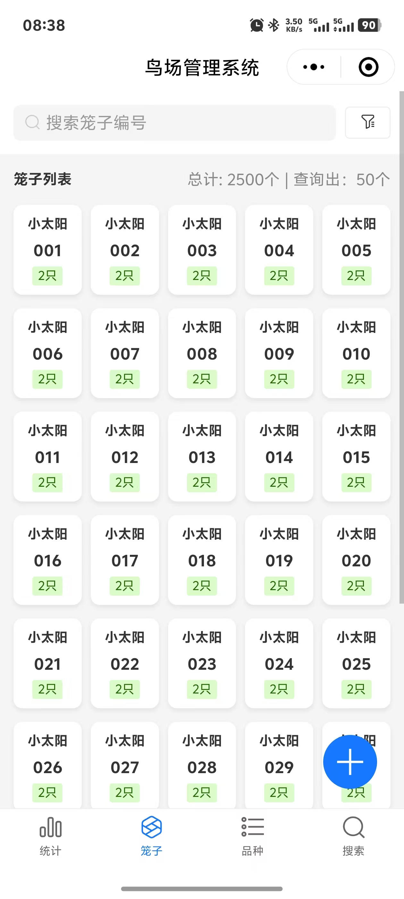
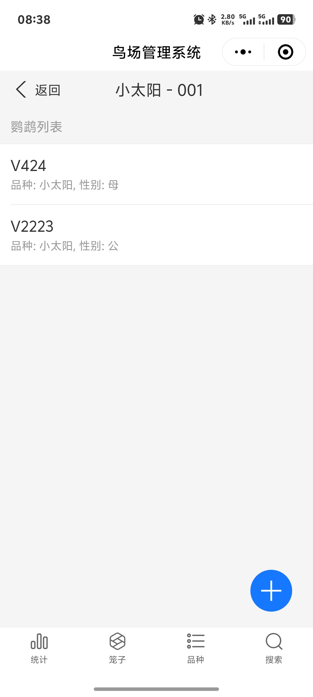
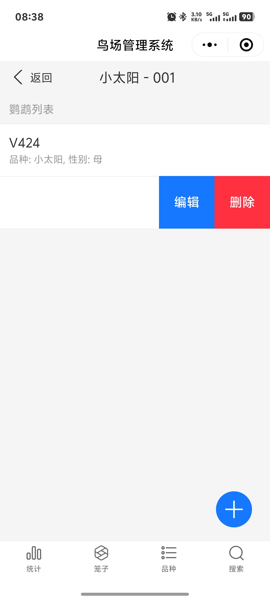
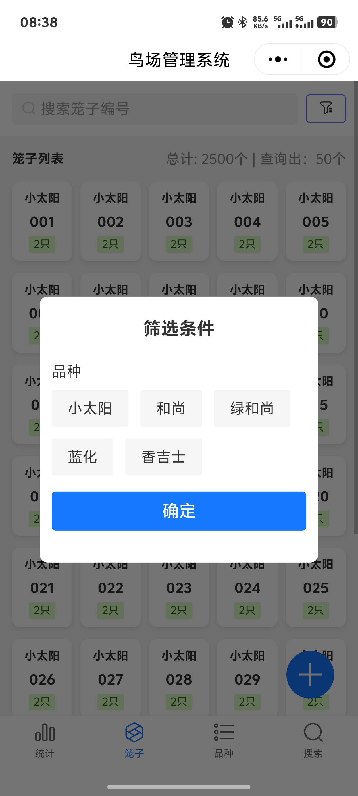
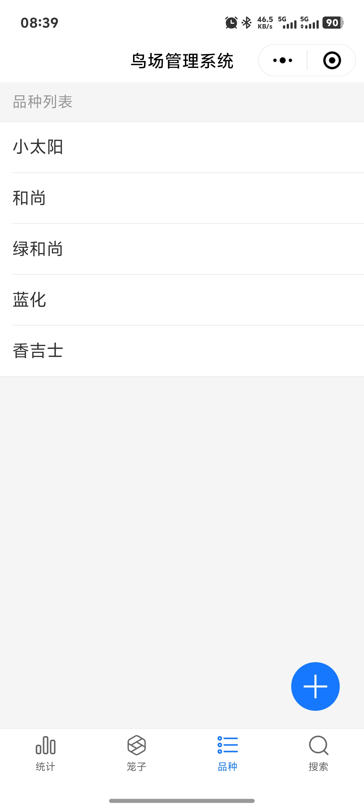
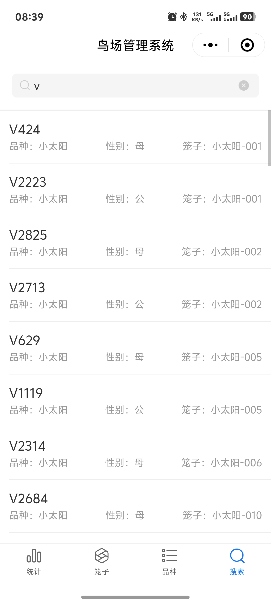

# 鹦鹉管理系统 (Parrot Management System)

一个现代化的鹦鹉信息管理系统，用于管理鹦鹉基本信息、笼舍分配以及相关统计数据。

## 技术栈

- React 18
- Vite 7
- Ant Design Mobile 5.x
- React Router DOM 7
- Axios
- ECharts (数据可视化)

## 功能特性

- 鹦鹉信息管理
  - 鹦鹉基本信息的增删改查
  - 物种信息管理
  - 鹦鹉搜索功能
- 笼舍管理
  - 笼舍信息维护
  - 鹦鹉-笼舍分配
  - 笼舍使用情况查看
- 品种管理
  - 鹦鹉品种信息维护
- 数据统计
  - 鹦鹉分布统计
  - 可视化数据展示

## 安装说明

确保你的开发环境中已安装 Node.js (推荐使用最新的LTS版本)

1. 克隆项目
```bash
git clone https://github.com/YanhaiSun/parrot-manage.git
cd parrot-react
```

2. 安装依赖
```bash
npm install
```

3. 启动开发服务器
```bash
npm run dev
```

4. 构建生产版本
```bash
npm run build
```

## 项目结构

```
src/
├── api/          # API 接口
├── assets/       # 静态资源
├── components/   # 公共组件
└── pages/        # 页面组件
    ├── CageManagement.jsx     # 笼舍管理
    ├── CageParrotList.jsx     # 笼舍鹦鹉列表
    ├── ParrotManagement.jsx   # 鹦鹉管理
    ├── ParrotStatistics.jsx   # 统计信息
    ├── SearchParrot.jsx       # 鹦鹉搜索
    └── SpeciesManagement.jsx  # 物种管理
```

## 开发命令

- `npm run dev` - 启动开发服务器
- `npm run build` - 构建生产版本
- `npm run lint` - 运行代码检查
- `npm run preview` - 预览生产构建

## 部署说明

项目使用 Vite 构建，生产版本的文件将会生成在 `dist` 目录中。你可以将该目录下的文件部署到任何静态文件服务器上。

项目的基础路由配置为 `/parrot-web`，如需修改可在 `package.json` 中更改 `homepage` 字段。

## 特性

项目使用了 Ant Design Mobile 5.x 作为 UI 框架，提供了现代化的移动端用户界面。ECharts 用于数据可视化，展示鹦鹉分布���笼舍使用情况等统计信息。
H5页面具有通用性，可以在小程序中使用

## 小程序内嵌H5预览
<div align="center">
  
  
  
  
  
  
  
  
  
</div>

## 技术支持联系

如果你在使用过程中遇到问题或有任何建议，欢迎通过以下方式联系我：
<div>
  
</div>

## 给个Star支持一下
如果你觉得这个项目对��有帮助，欢迎给个 Star ⭐️ 支持一下

## 请作者喝杯咖啡
<div>
  
</div>
